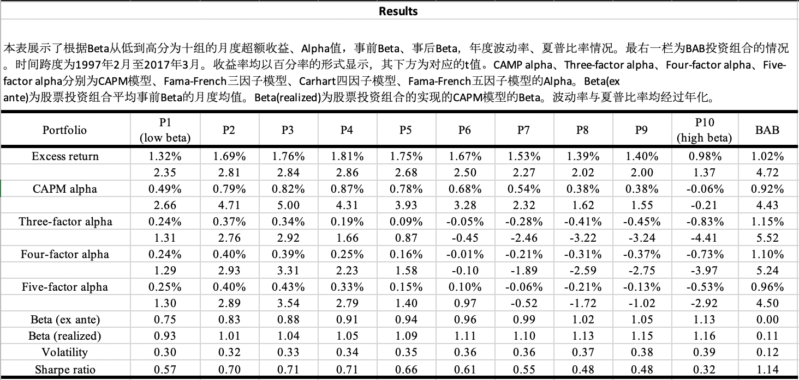

# Betting Against Beta
Betting Against Beta is a factor inspired by [AQR Capital Mangement](https://www.aqr.com/Insights/Research/Journal-Article/Betting-Against-Beta).

# Steps
* data_reader.sas: read the data
* volatility.sas: calculate the volotility of each stock and the market
* correlation_coefficient.sas: calculate the correlation coefficient of each stock and the market
* ex_ante_beta.sas: calculate th ex-ante beta of each stock
* betting_against_beta.sas: form the betting against beta of each stock
* excess_returns.sas: calculate the excess returns of each portfolio
* alpha_and_beta.sas: calculate the ex-ante beta, realized beta, alpha of CAPM, alphas of Fama-Frech three/four/five factors models of each portfolios
* portfolio_volatility.sas: calculate the volatility of each portfolio
* portfolio_sharpe_ratio.sas: calculate the Sharpe ratio of each portfolio
* effect_of_bab_factor.sas: calculate the excess return, alphas, volatility and Sharpe ratio of the BAB factor.

# Results

